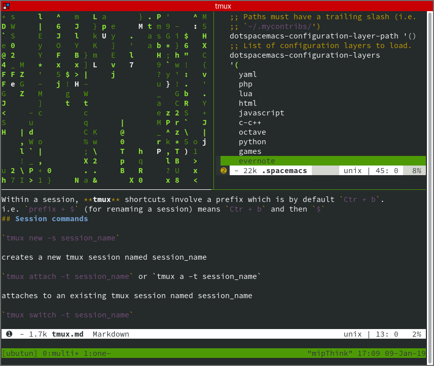

Session => Window => Panel 

Within a session, **tmux** shortcuts involve a prefix which is by default `Ctr + b`.
i.e. `prefix + $` (for renaming a session) means `Ctr + b` and then `$`
## Session commands

`tmux new -s session_name`

creates a new tmux session named session_name

`tmux attach -t session_name` or `tmux a -t session_name`

attaches to an existing tmux session named session_name

`tmux switch -t session_name`

switches to an existing session named session_name

`tmux list-sessions`

lists existing tmux sessions

`tmux detach (prefix + d)`

detach the currently attached session

`tmux rename-session [-t target-session] session_name (prefix + $)` 

rename session

## Windows
`tmux new-window (prefix + c)`

create a new window

`tmux select-window -t :0-9 (prefix + 0-9)`

move to the window based on index

`tmux rename-window (prefix + ,)`

rename the current window

## Pane

`tmux split-window (prefix + ")`

splits the window into two vertical panes

`tmux split-window -h (prefix + %)`

splits the window into two horizontal panes

`tmux swap-pane -[UD] (prefix + { or })`

swaps pane with another in the specified direction

`tmux select-pane -[UDLR] (prefix + up or down or left or right )`

selects the next pane in the specified direction

`tmux select-pane -t :.+ (prefix + o)`

selects the next pane in numerical order

## Misc commands
`tmux list-keys`

lists out every bound key and the tmux command it runs

`tmux list-commands`

lists out every tmux command and its arguments

`tmux info`

lists out every session, window, pane, its pid, etc.

`tmux source-file ~/.tmux.conf`

reloads the current tmux configuration (based on a default tmux config)
